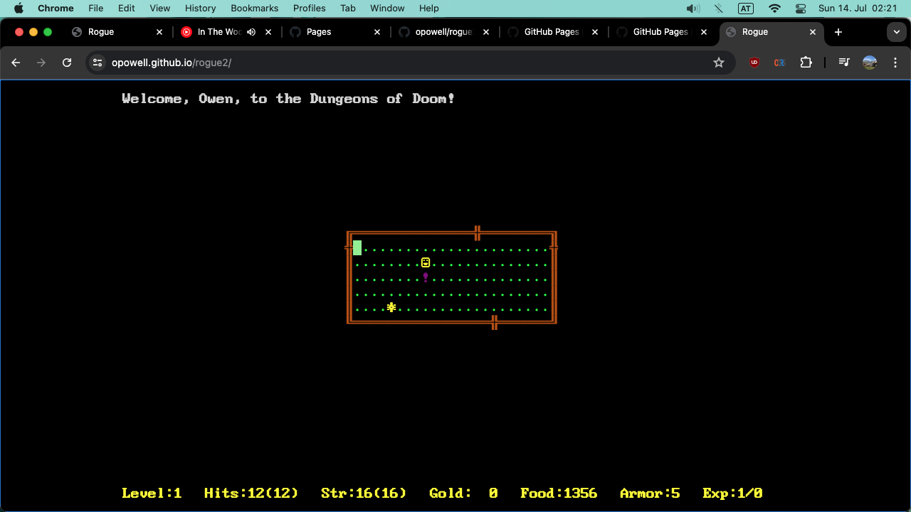
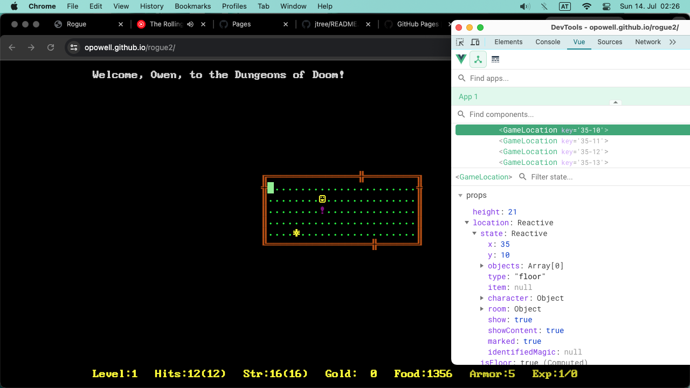
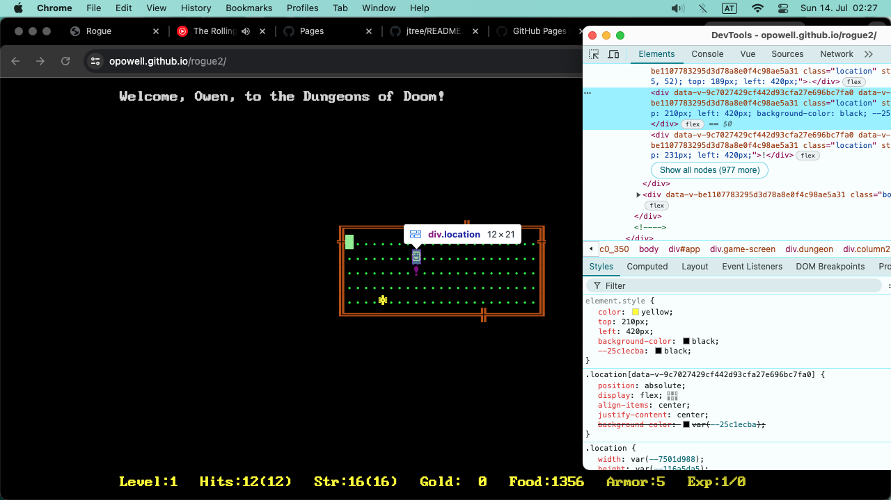

# Rogue
This is a "no-build-step" browser re-make of Rogue: Dungeons of Doom.

## <a href="https://opowell.github.io/rogue2/">Play online</a>

## Playing somewhere else
1. Download source code.
2. Serve via a web server.
- JAS
- node/express

## Technical details
- no-build Javascript+HTML+CSS.
- Vue 3.
- Regular HTML elements, no Canvas.

## Feature roadmap
See <a href="/TODO.md">TODO.md</a>
